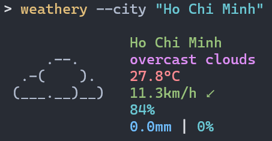

<h1 align="center">weathery</h1>

<p align="center">
Minimal, customizable and neofetch-like weather CLI inspired by
<a href="https://github.com/ashish0kumar/stormy">stormy</a>, written in TypeScript
</p>

---

## Motivation

weathery's idea, structure, and design are based off
[stormy](https://github.com/ashish0kumar/stormy), but it's written in TypeScript instead of Golang.

I built this because I have large interest in CLI tools and the concept of this simple _stormy_ app just clicked. Besides, I believe building useful projects is an effective way to learn new languages.

## Features

- Multiple weather providers: OpenMeteo (default, no API key required) and OpenWeatherMap
- Current weather conditions with ASCII art representation
- Temperature, wind, humidity, and precipitation information
- Customizable units (metric, imperial)
- Local configuration file
- Color support for terminals
- Compact display mode
- Works out of the box with OpenMeteo

## Installation

### Prerequisites

- Node.js 16.0.0 or higher
- **Optional:** An API key from [OpenWeatherMap](https://openweathermap.org/api)

### Via npm

```bash
npm install -g weathery
```

### Build from Source

```bash
# Clone the repository
git clone https://github.com/yourusername/weathery.git
cd weathery

# Install dependencies
npm install

# Build the application
npm run build

# Install globally
npm install -g .
```

### Download Binaries

Pre-built binaries for Linux, macOS, and Windows are available on the [Releases](https://github.com/yourusername/weathery/releases) page.

## Configuration

`weathery` will create a default configuration file on first run:

- Linux/macOS: `~/.config/weathery/config.json`
- Windows: `%APPDATA%\weathery\config.json`

### Configuration Options

- `provider`: Weather data provider ("`OpenMeteo`" or "`OpenWeatherMap`"). Defaults to "`OpenMeteo`".
- `apiKey`: Your OpenWeatherMap API key.
- `city`: The city for which to fetch weather data.
- `units`: Units for temperature and wind speed (`metric` or `imperial`).
- `showCityName`: Whether to display the city name (`true` or `false`).
- `useColors`: Enables and disables text colors (`true` or `false`).
- `compact`: Use a more compact display format (`true` or `false`).

### Example Config

#### Default Configuration (OpenMeteo - No API Key Required)

```json
{
  "provider": "OpenMeteo",
  "apiKey": "",
  "city": "Ho Chi Minh",
  "units": "metric",
  "showCityName": true,
  "useColors": false,
  "compact": false
}
```

#### OpenWeatherMap Configuration

```json
{
  "provider": "OpenWeatherMap",
  "apiKey": "your_openweathermap_api_key",
  "city": "Ho Chi Minh",
  "units": "metric",
  "showCityName": true,
  "useColors": false,
  "compact": false
}
```

## Usage

```bash
# Basic usage
weathery

# Specify city via command line
weathery --city "New York"

# Use imperial units
weathery --units imperial

# Use compact display mode
weathery --compact

# Show help
weathery --help

# Show config file location
weathery --show-config
```

## Examples


<br>
More examples can be found at [assets](https://github.com/onbao165/weathery/tree/main/assets)

## Acknowledgements

- [OpenWeatherMap](https://openweathermap.org/) and [Open-Meteo](https://open-meteo.com/) for providing weather data
- [stormy](https://github.com/ashish0kumar/stormy) for the overall idea, structure and design of the project

<br>

<p align="center">
        <i><code>&copy 2025-present <a href="https://github.com/yourusername">Barooon165</a></code></i>
</p>
